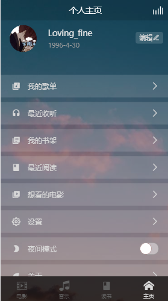
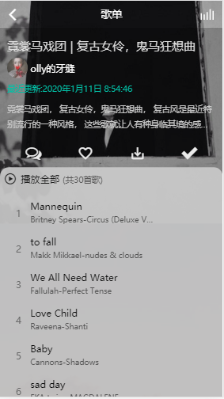

#### vue全家桶，webpack，构建移动web App，作为一个综合性的移动web，集电影推荐，音乐播放，热门书籍观看。

+ 下载解压文件，安装依赖

```
npm i 
or
yarn install

```

+ 使用webpack-dev-server 运行

```
npm start
or
yarn serve

```

+ 打包命令

```
webpack
```

如项目无法运行可能是某些第三方包源问题。

下面是一些部分截图，功能比较多，就不多介绍了。交流学习，欢迎建议批评








